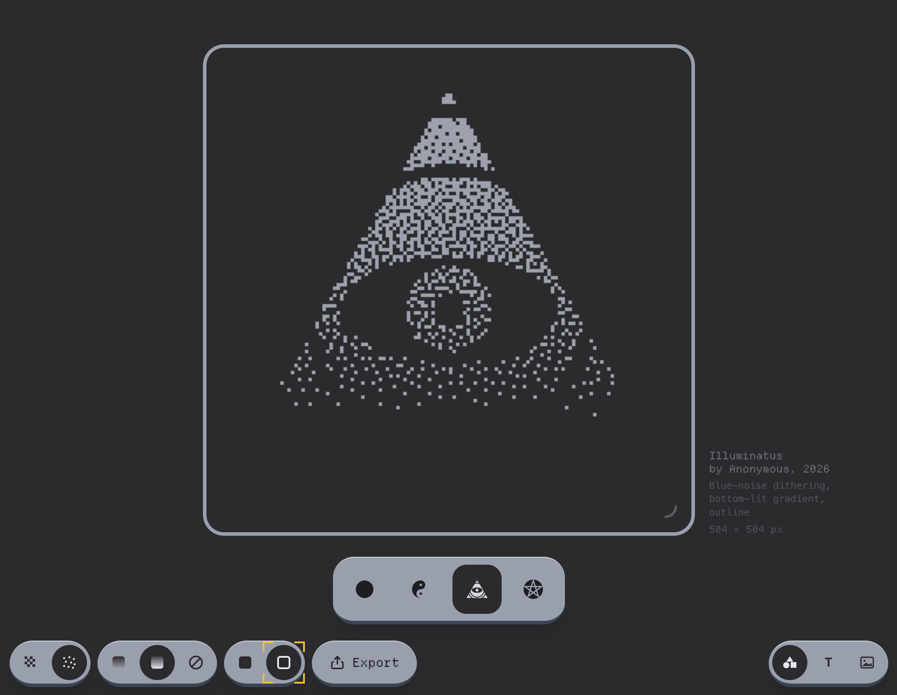

# Dithr

Small, fun dithering toy.

Pick a shape, text, or image and rendering options. Play with the canvas size.

Export when you find something cool!

Deployed to [dithr.haila.fi](https://dithr.haila.fi/).

## Stack

Vue 3, TypeScript, Tailwind 4, Vite+ toolchain.

## Commands

- `vp install` — deps
- `vp dev` — dev server
- `vp build` — prod build
- `vp check` / `vp check --fix` — format + lint + typecheck

## License

CC BY 4.0

## Credits

Code mostly by Claude Opus but my opinions are my own.

Blue noise texture (`src/assets/blue-noise-128.png`) from [Calinou/free-blue-noise-textures](https://github.com/Calinou/free-blue-noise-textures), licensed under CC0.

Departure Mono font from [rektdeckard/departure-mono](https://github.com/rektdeckard/departure-mono), licensed under OFL-1.0.
